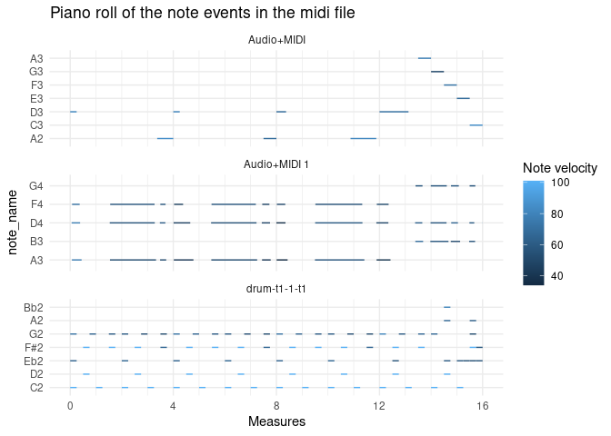

<!-- README.md is generated from README.Rmd. Please edit that file -->

# pyramidi

<!-- badges: start -->

<!-- badges: end -->

**Work in progress\!**

The goal of pyramidi is to read in dataframes generated by the python
package [miditapyr](https://pypi.org/project/miditapyr/). These
dataframes contain midi data. Then the midi information (one line per
event) can be translated into a wide format (one line per note). This
facilitates plotting piano roll plots. These dataframes can then be
written back to midi files (again using miditapyr).

## Installation

You can install pyramidi from
[github](https://github.com/urswilke/pyramidi) with:

``` r
## install remotes package if it's not already
if (!requireNamespace("remotes", quietly = TRUE)) {
  install.packages("remotes")
}

## install dev version of rtweettree from github
remotes::install_github("UrsWilke/pyramidi")
```

The python package [miditapyr](https://pypi.org/project/miditapyr/) also
needs to be installed via

``` sh
pip install miditapyr
```

in your virtual environment.

## Basic usage

### Load libraries

``` r
library(pyramidi)
library(tidyverse)
library(zeallot)
mt <- reticulate::import("miditapyr")
mido <- reticulate::import("mido")
```

### Extract midi file information into dataframes

``` r
mid_file <- system.file("extdata", "test_midi_file.mid", package = "pyramidi")
mido$MidiFile(mid_file) %>%
  mt$mido_midi_df()  %->% c(df_meta, df_notes, ticks_per_beat)
```

``` r
df_meta
#>                type         name time  tempo numerator denominator
#> 0        track_name Drum Machine    0    NaN       NaN         NaN
#> 3         set_tempo          nan    0 545454       NaN         NaN
#> 4    time_signature          nan    0    NaN         4           4
#> 2151   end_of_track          nan  241    NaN       NaN         NaN
#> 2152     track_name         FM-4    0    NaN       NaN         NaN
#> 2435   end_of_track          nan 1954    NaN       NaN         NaN
#> 2436     track_name         FM-4    0    NaN       NaN         NaN
#> 4969   end_of_track          nan  202    NaN       NaN         NaN
#>      clocks_per_click notated_32nd_notes_per_beat i_track
#> 0                 NaN                         NaN       1
#> 3                 NaN                         NaN       1
#> 4                  24                           8       1
#> 2151              NaN                         NaN       1
#> 2152              NaN                         NaN       2
#> 2435              NaN                         NaN       2
#> 2436              NaN                         NaN       3
#> 4969              NaN                         NaN       3
```

``` r
df_notes %>% as_tibble()
#> # A tibble: 4,962 x 7
#>    type     name   time  note velocity channel i_track
#>    <chr>    <chr> <dbl> <dbl>    <dbl>   <dbl>   <dbl>
#>  1 note_on  nan       0    38      101       9       1
#>  2 note_on  nan       0    36      101       9       1
#>  3 note_off nan     240    38      101       9       1
#>  4 note_off nan       0    36      101       9       1
#>  5 note_on  nan    1200    38      101       9       1
#>  6 note_off nan     240    38      101       9       1
#>  7 note_on  nan     240    38      101       9       1
#>  8 note_on  nan       0    36      101       9       1
#>  9 note_off nan     240    38      101       9       1
#> 10 note_off nan       0    36      101       9       1
#> # … with 4,952 more rows
```

``` r
ticks_per_beat
#> [1] 960
```

### Pivot note dataframe to wide

``` r

df_notes_wide <-  
  tab_measures(df_meta, df_notes, ticks_per_beat) %>%
  widen_events() %>%
  left_join(pyramidi::midi_defs)
#> Joining, by = "note"
df_notes_wide
#> # A tibble: 2,481 x 18
#>    i_track name  channel  note i_note m_note_on m_note_off b_note_on b_note_off
#>      <dbl> <chr>   <dbl> <dbl>  <int>     <dbl>      <dbl>     <dbl>      <dbl>
#>  1       1 nan         9    38      1       0         0.25        0          1 
#>  2       1 nan         9    36      1       0         0.25        0          1 
#>  3       1 nan         9    38      2       1.5       1.75        6          7.
#>  4       1 nan         9    38      3       2         2.25        8          9 
#>  5       1 nan         9    36      2       2         2.25        8          9 
#>  6       1 nan         9    38      4       3.5       3.75       14.        15 
#>  7       1 nan         9    38      5       4         4.25       16         17.
#>  8       1 nan         9    36      3       4         4.25       16         17.
#>  9       1 nan         9    38      6       5.5       5.75       22         23.
#> 10       1 nan         9    38      7       6         6.25       24         25 
#> # … with 2,471 more rows, and 9 more variables: t_note_on <dbl>,
#> #   t_note_off <dbl>, ticks_note_on <dbl>, ticks_note_off <dbl>,
#> #   time_note_on <dbl>, time_note_off <dbl>, velocity_note_on <dbl>,
#> #   velocity_note_off <dbl>, note_name <fct>
```

### Plot the midi file information in a piano roll plot

``` r
p1 <- df_notes_wide %>%
  ggplot() +
  geom_segment(
    aes(
      x = m_note_on,
      y = note_name,
      xend = m_note_off,
      yend = note_name,
      color = velocity_note_on
    )
  ) +
  # each midi track is printed into its own facet:
  facet_wrap( ~ i_track,
              ncol = 1,
              scales = "free_y")
p1
```



### Pivot note data frame back to long format

``` r
df_notes_out <- 
  df_notes_wide %>% 
  select(c("i_track", "name", "channel", "note", "i_note"), matches("_note_o[nf]f?$")) %>% 
  pivot_longer(matches("_note_o[nf]f?$"),
               names_to = c(".value", "type"),
               names_pattern = "(.+?)_(.*)") %>% 
  arrange(i_track, t)

df_notes_out <- 
  df_notes_out %>% 
  group_by(i_track) %>% 
  mutate(time = ticks - lag(ticks) %>% {.[1] = 0; .}) %>% 
  ungroup()

df_notes_out
#> # A tibble: 4,962 x 12
#>    i_track name  channel  note i_note type      m     b     t ticks  time
#>      <dbl> <chr>   <dbl> <dbl>  <int> <chr> <dbl> <dbl> <dbl> <dbl> <dbl>
#>  1       1 nan         9    38      1 note…  0       0  0         0     0
#>  2       1 nan         9    36      1 note…  0       0  0         0     0
#>  3       1 nan         9    38      1 note…  0.25    1  0.136   240   240
#>  4       1 nan         9    36      1 note…  0.25    1  0.136   240     0
#>  5       1 nan         9    38      2 note…  1.5     6  0.818  1440  1200
#>  6       1 nan         9    38      2 note…  1.75    7. 0.955  1680   240
#>  7       1 nan         9    38      3 note…  2       8  1.09   1920   240
#>  8       1 nan         9    36      2 note…  2       8  1.09   1920     0
#>  9       1 nan         9    38      3 note…  2.25    9  1.23   2160   240
#> 10       1 nan         9    36      2 note…  2.25    9  1.23   2160     0
#> # … with 4,952 more rows, and 1 more variable: velocity <dbl>
```

### Write midi dataframe back to a midi file

``` r
mt$df_2_midi(df_meta %>% mutate(time = as.integer(time)), 
             df_notes_out, 
             ticks_per_beat, 
             "test.mid")
```
