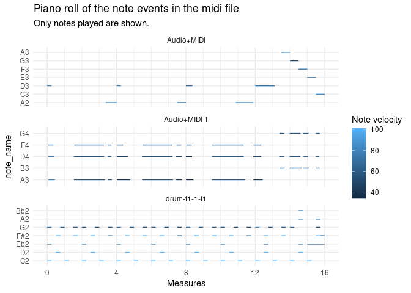

<!-- README.md is generated from README.Rmd. Please edit that file -->

# pyramidi

<!-- badges: start -->

[](https://travis-ci.com/urswilke/pyramidi)
[](https://codecov.io/gh/urswilke/pyramidi?branch=master)
<!-- badges: end -->

**Work in progress\!**

The goal of pyramidi is to read in dataframes generated by the python
package [miditapyr](https://pypi.org/project/miditapyr/). These
dataframes contain midi data. Then the midi information (one line per
event) can be translated into a wide format (one line per note). This
facilitates plotting piano roll plots. These dataframes can then be
written back to midi files (again using miditapyr).

## Installation

You can install pyramidi from
[github](https://github.com/urswilke/pyramidi) with:

``` r
## install remotes package if it's not already
if (!requireNamespace("remotes", quietly = TRUE)) {
  install.packages("remotes")
}

## install dev version of rtweettree from github
remotes::install_github("UrsWilke/pyramidi")
```

The python package [miditapyr](https://pypi.org/project/miditapyr/) also
needs to be installed via

``` sh
pip install miditapyr
```

in your virtual environment.

## Basic usage

### Load libraries

``` r
library(pyramidi)
library(tidyverse)
library(zeallot)
mt <- reticulate::import("miditapyr")
mido <- reticulate::import("mido")
```

### Extract midi file information into dataframe

``` r
midi_file_str <- system.file("extdata", "test_midi_file.mid", package = "pyramidi")

midifile <- mido$MidiFile(midi_file_str)
ticks_per_beat <- midifile$ticks_per_beat

dfc = mt$midi_to_df(midifile)
head(dfc, 20)
#>    i_track  meta                            msg
#> 1        0  TRUE    track_name, drum-t1-1-t1, 0
#> 2        0 FALSE          note_on, 0, 43, 72, 9
#> 3        0 FALSE          note_on, 0, 39, 64, 9
#> 4        0 FALSE         note_on, 0, 36, 101, 9
#> 5        0  TRUE           set_tempo, 666666, 0
#> 6        0  TRUE time_signature, 4, 4, 24, 8, 0
#> 7        0 FALSE       note_off, 240, 43, 72, 9
#> 8        0 FALSE         note_off, 0, 39, 64, 9
#> 9        0 FALSE        note_off, 0, 36, 101, 9
#> 10       0 FALSE       note_on, 240, 42, 101, 9
#> 11       0 FALSE         note_on, 0, 38, 101, 9
#> 12       0 FALSE        note_on, 240, 43, 64, 9
#> 13       0 FALSE        note_off, 0, 42, 101, 9
#> 14       0 FALSE        note_off, 0, 38, 101, 9
#> 15       0 FALSE       note_off, 240, 43, 64, 9
#> 16       0 FALSE         note_on, 0, 36, 101, 9
#> 17       0 FALSE      note_off, 240, 36, 101, 9
#> 18       0 FALSE        note_on, 240, 43, 60, 9
#> 19       0 FALSE         note_on, 0, 42, 101, 9
#> 20       0 FALSE       note_off, 240, 43, 60, 9
```

``` r
ticks_per_beat
#> [1] 960
```

``` r
df <- mt$tidy_df(dfc) %>% as_tibble()
head(df, 20)
#> # A tibble: 20 x 13
#>    i_track meta  type  name   time  note velocity channel  tempo numerator
#>      <dbl> <lgl> <chr> <lis> <dbl> <dbl>    <dbl>   <dbl>  <dbl>     <dbl>
#>  1       0 TRUE  trac… <chr…     0   NaN      NaN     NaN    NaN       NaN
#>  2       0 FALSE note… <dbl…     0    43       72       9    NaN       NaN
#>  3       0 FALSE note… <dbl…     0    39       64       9    NaN       NaN
#>  4       0 FALSE note… <dbl…     0    36      101       9    NaN       NaN
#>  5       0 TRUE  set_… <dbl…     0   NaN      NaN     NaN 666666       NaN
#>  6       0 TRUE  time… <dbl…     0   NaN      NaN     NaN    NaN         4
#>  7       0 FALSE note… <dbl…   240    43       72       9    NaN       NaN
#>  8       0 FALSE note… <dbl…     0    39       64       9    NaN       NaN
#>  9       0 FALSE note… <dbl…     0    36      101       9    NaN       NaN
#> 10       0 FALSE note… <dbl…   240    42      101       9    NaN       NaN
#> 11       0 FALSE note… <dbl…     0    38      101       9    NaN       NaN
#> 12       0 FALSE note… <dbl…   240    43       64       9    NaN       NaN
#> 13       0 FALSE note… <dbl…     0    42      101       9    NaN       NaN
#> 14       0 FALSE note… <dbl…     0    38      101       9    NaN       NaN
#> 15       0 FALSE note… <dbl…   240    43       64       9    NaN       NaN
#> 16       0 FALSE note… <dbl…     0    36      101       9    NaN       NaN
#> 17       0 FALSE note… <dbl…   240    36      101       9    NaN       NaN
#> 18       0 FALSE note… <dbl…   240    43       60       9    NaN       NaN
#> 19       0 FALSE note… <dbl…     0    42      101       9    NaN       NaN
#> 20       0 FALSE note… <dbl…   240    43       60       9    NaN       NaN
#> # … with 3 more variables: denominator <dbl>, clocks_per_click <dbl>,
#> #   notated_32nd_notes_per_beat <dbl>
```

``` r
dfm <- tab_measures(df, ticks_per_beat) %>%
  # create a variable `track` with the track name (in order to have it in the plot below)
  mutate(track = ifelse(purrr::map_chr(name, typeof) != "character", 
                        list(NA_character_), 
                        name)) %>%
  unnest(cols = track) %>% 
  fill(track)
```

``` r
dfm %>% 
    mt$split_df()  %->% c(df_meta, df_notes)
```

``` r
df_meta %>% as_tibble()
#> # A tibble: 8 x 16
#>   i_track meta  type  name   time  tempo numerator denominator clocks_per_click
#>     <dbl> <lgl> <chr> <lis> <dbl>  <dbl>     <dbl>       <dbl>            <dbl>
#> 1       0 TRUE  trac… <chr…     0    NaN       NaN         NaN              NaN
#> 2       0 TRUE  set_… <dbl…     0 666666       NaN         NaN              NaN
#> 3       0 TRUE  time… <dbl…     0    NaN         4           4               24
#> 4       0 TRUE  end_… <dbl…     1    NaN       NaN         NaN              NaN
#> 5       1 TRUE  trac… <chr…     0    NaN       NaN         NaN              NaN
#> 6       1 TRUE  end_… <dbl…     1    NaN       NaN         NaN              NaN
#> 7       2 TRUE  trac… <chr…     0    NaN       NaN         NaN              NaN
#> 8       2 TRUE  end_… <dbl…     1    NaN       NaN         NaN              NaN
#> # … with 7 more variables: notated_32nd_notes_per_beat <dbl>, ticks <dbl>,
#> #   t <dbl>, m <dbl>, b <dbl>, i_note <int>, track <chr>
```

``` r
df_notes %>% as_tibble()
#> # A tibble: 260 x 13
#>    i_track meta  type   time  note velocity channel ticks     t     m     b
#>      <dbl> <lgl> <chr> <dbl> <dbl>    <dbl>   <dbl> <dbl> <dbl> <dbl> <dbl>
#>  1       0 FALSE note…     0    43       72       9     0 0      0        0
#>  2       0 FALSE note…     0    39       64       9     0 0      0        0
#>  3       0 FALSE note…     0    36      101       9     0 0      0        0
#>  4       0 FALSE note…   240    43       72       9   240 0.167  0.25     1
#>  5       0 FALSE note…     0    39       64       9   240 0.167  0.25     1
#>  6       0 FALSE note…     0    36      101       9   240 0.167  0.25     1
#>  7       0 FALSE note…   240    42      101       9   480 0.333  0.5      2
#>  8       0 FALSE note…     0    38      101       9   480 0.333  0.5      2
#>  9       0 FALSE note…   240    43       64       9   720 0.500  0.75     3
#> 10       0 FALSE note…     0    42      101       9   720 0.500  0.75     3
#> # … with 250 more rows, and 2 more variables: i_note <int>, track <chr>
```

### Pivot note dataframe to wide

``` r
df_not_notes <- 
  df_notes %>% 
  dplyr::filter(!stringr::str_detect(.data$type, "^note_o[nf]f?$")) 

df_notes_wide <-
  df_notes %>% 
  dplyr::filter(stringr::str_detect(.data$type, "^note_o[nf]f?$")) %>%
  # tab_measures(df_meta, df_notes, ticks_per_beat) %>%
  widen_events() %>%
  left_join(pyramidi::midi_defs)
#> Joining, by = "note"
df_notes_wide
#> # A tibble: 130 x 19
#>    i_track meta   note channel i_note track m_note_on m_note_off b_note_on
#>      <dbl> <lgl> <dbl>   <dbl>  <int> <chr>     <dbl>      <dbl>     <dbl>
#>  1       0 FALSE    43       9      1 drum…      0          0.25         0
#>  2       0 FALSE    39       9      1 drum…      0          0.25         0
#>  3       0 FALSE    36       9      1 drum…      0          0.25         0
#>  4       0 FALSE    42       9      1 drum…      0.5        0.75         2
#>  5       0 FALSE    38       9      1 drum…      0.5        0.75         2
#>  6       0 FALSE    43       9      2 drum…      0.75       1            3
#>  7       0 FALSE    36       9      2 drum…      1          1.25         4
#>  8       0 FALSE    43       9      3 drum…      1.5        1.75         6
#>  9       0 FALSE    42       9      2 drum…      1.5        1.75         6
#> 10       0 FALSE    43       9      4 drum…      2          2.25         8
#> # … with 120 more rows, and 10 more variables: b_note_off <dbl>,
#> #   t_note_on <dbl>, t_note_off <dbl>, ticks_note_on <dbl>,
#> #   ticks_note_off <dbl>, time_note_on <dbl>, time_note_off <dbl>,
#> #   velocity_note_on <dbl>, velocity_note_off <dbl>, note_name <fct>
```

### Plot the midi file information in a piano roll plot

``` r
df_notes_wide %>%
  ggplot() +
  geom_segment(
    aes(
      x = m_note_on,
      y = note_name,
      xend = m_note_off,
      yend = note_name,
      color = velocity_note_on
    )
  ) +
  # each midi track is printed into its own facet:
  facet_wrap( ~ track,
              ncol = 1,
              scales = "free_y") + 
  guides(color=guide_colorbar(title="Note velocity")) +
  labs(title = "Piano roll of the note events in the midi file") +
  xlab("Measures") +
  scale_x_continuous(breaks = seq(0, 16, 4),
                     minor_breaks = 0:16) +
  scale_colour_gradient() +
  theme_minimal()
```



### Pivot note data frame back to long format

``` r
df_notes_out <-
  df_notes_wide %>%
  select(c("i_track",
           "channel", "note", "i_note"), matches("_note_o[nf]f?$")) %>%
  pivot_longer(matches("_note_o[nf]f?$"),
               names_to = c(".value", "type"),
               names_pattern = "(.+?)_(.*)") %>%
  # note events are not meta events (cf.
  # https://mido.readthedocs.io/en/latest/midi_files.html?highlight=meta#meta-messages):
  mutate(meta = FALSE)
```

### Join non note events

``` r
df_notes_out <-
  df_notes_out %>%
  full_join(df_meta) %>%
  full_join(df_not_notes) %>%
  # It is important to put the events in the right order:
  arrange(i_track, ticks) %>%
  group_by(i_track) %>%
  # Now we can calculate the time increments between events;
  # The first event of each track is set to 0:
  mutate(time = ticks - lag(ticks) %>% {.[1] = 0; .}) %>%
  ungroup()
#> Joining, by = c("i_track", "i_note", "type", "m", "b", "t", "ticks", "time", "meta")
#> Joining, by = c("i_track", "channel", "note", "i_note", "type", "m", "b", "t", "ticks", "time", "velocity", "meta", "track")

df_notes_out
#> # A tibble: 268 x 19
#>    i_track channel  note i_note type      m     b     t ticks  time velocity
#>      <dbl>   <dbl> <dbl>  <int> <chr> <dbl> <dbl> <dbl> <dbl> <dbl>    <dbl>
#>  1       0       9    43      1 note…  0        0 0         0     0       72
#>  2       0       9    39      1 note…  0        0 0         0     0       64
#>  3       0       9    36      1 note…  0        0 0         0     0      101
#>  4       0      NA    NA      0 trac…  0        0 0         0     0       NA
#>  5       0      NA    NA      0 set_…  0        0 0         0     0       NA
#>  6       0      NA    NA      0 time…  0        0 0         0     0       NA
#>  7       0       9    43      1 note…  0.25     1 0.167   240   240       72
#>  8       0       9    39      1 note…  0.25     1 0.167   240     0       64
#>  9       0       9    36      1 note…  0.25     1 0.167   240     0      101
#> 10       0       9    42      1 note…  0.5      2 0.333   480   240      101
#> # … with 258 more rows, and 8 more variables: meta <lgl>, name <list>,
#> #   tempo <dbl>, numerator <dbl>, denominator <dbl>, clocks_per_click <dbl>,
#> #   notated_32nd_notes_per_beat <dbl>, track <chr>
```

### Write midi dataframe back to a midi file

``` r
dfc2 <-
  df_notes_out %>%
  # For midi export the new columns are removed:
  select(names(df)) %>%
  # When reticulate converts R dataframes to pandas, there are complications
  # with character columns containing missing values.
  # repair_reticulate_conversion = TRUE, repairs that in the miditapyr python
  # code:
  mt$compact_df(repair_reticulate_conversion = TRUE)
dfc2 %>% as_tibble()
#> # A tibble: 268 x 3
#>    i_track meta  msg             
#>      <dbl> <lgl> <list>          
#>  1       0 FALSE <named list [5]>
#>  2       0 FALSE <named list [5]>
#>  3       0 FALSE <named list [5]>
#>  4       0 TRUE  <named list [3]>
#>  5       0 TRUE  <named list [3]>
#>  6       0 TRUE  <named list [6]>
#>  7       0 FALSE <named list [5]>
#>  8       0 FALSE <named list [5]>
#>  9       0 FALSE <named list [5]>
#> 10       0 FALSE <named list [5]>
#> # … with 258 more rows
```

``` r
dfc2 %>%
  mt$df_to_midi(ticks_per_beat,
                "test.mid")
```
